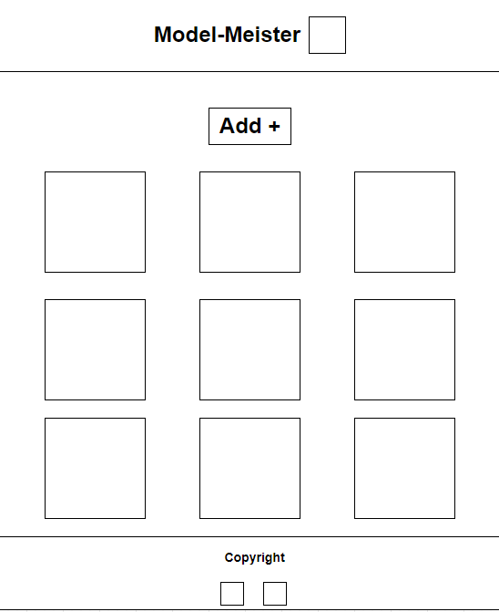
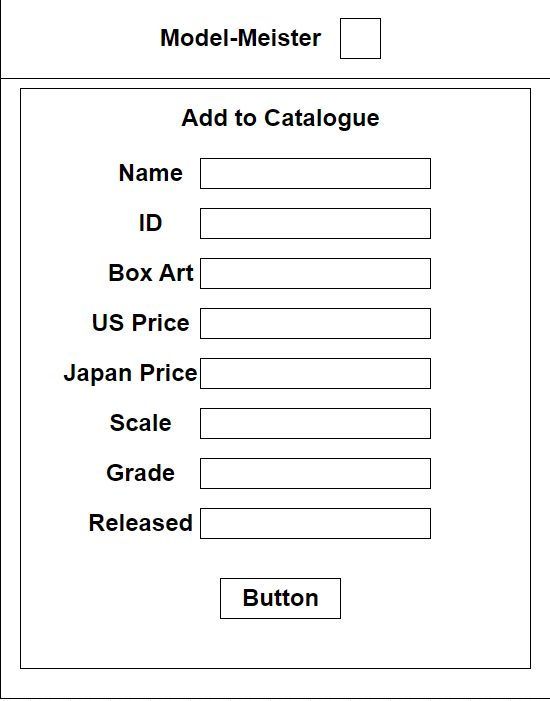
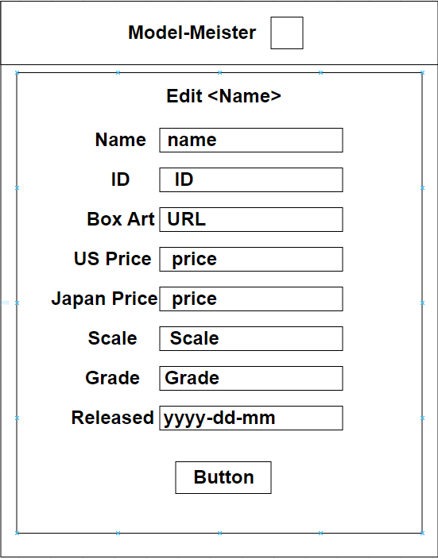
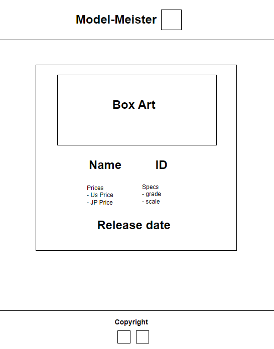
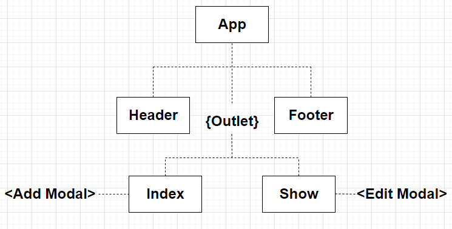

# Model Meister
## Christian Alexander

Model-Meister is a catalogue app for model kits that the user can add, edit or delete from their space that they want to build, have built, or are just their favorite!

Trello Board
- https://trello.com/b/XeFZt5Fu/model-meister

Netlify Deploy

# Mockup
## Index

## Add Form

## Edit Form

## Show

# Wireframe
